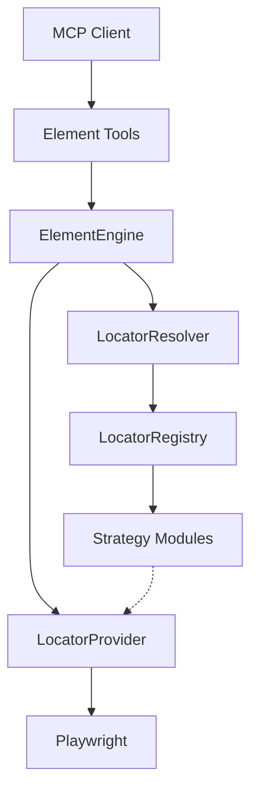

# Architecture

The Element Engine serves as a middle layer between the MCP interface and the underlying browser automation engine (Playwright).

## Design Principles

1. **Open/Closed Principle**: Locator strategies are modular (`css`, `xpath`, `aria`, `text`). Adding a new strategy requires implementing a new module in the `locators/` package without changing the `ElementEngine` core.
2. **Decoupled from Playwright**: The `ElementEngine` communicates with a `LocatorProvider` interface, avoiding direct calls to `playwright.async_api`. This allows future replacement with other engines.
3. **Optimized Repeated Interaction**: The engine assigns an `element_id` to resolved locators, caching them. This prevents redundant DOM queries.

## Component Diagram

## State Ownership
The `ElementEngine` uses the `StateManager` to validate that elements belong to valid, active sessions, contexts, and pages. When a page is closed, its associated cached elements are automatically released to prevent stale references.
